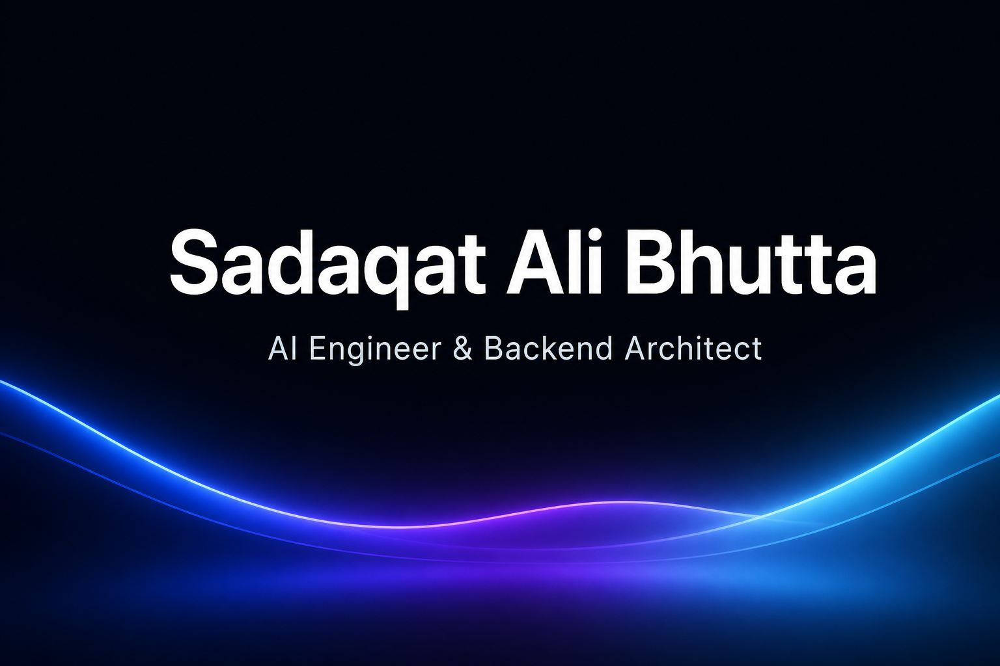

<!-- Premium header (hosted in-repo — GitHub camo breaks capsule-render SVGs) -->
<p align="center">
  
</p>

<h1 align="center">Hi, I'm Sadaqat Ali Bhutta 👋</h1>

<p align="center">
  <b>AI Engineer · Backend Architect · Python Expert · LLM Developer</b>
</p>

<p align="center">
  
</p>

<p align="center">
  I build scalable backends, AI agents, and data systems — from clean APIs to production LLM workflows.
</p>

<!-- CTA buttons -->
<p align="center">
  <a href="mailto:sadaqatxbhutta@gmail.com"></a>
  <a href="https://github.com/sadaqatbhutta"></a>
  <a href="https://linkedin.com/in/sadaqat-bhutta"></a>
  <a href="https://qr-code-generator-five-swart.vercel.app"></a>
</p>

<!-- Identity chips -->
<p align="center">
  
  
  
  
  
  
  
  
</p>

---

### 💻 `whoami`

```bash
$ whoami
> Sadaqat Ali Bhutta
> AI Engineer & Backend Architect
> Stack  →  Python · FastAPI · LLMs · Docker · PostgreSQL
> Focus  →  Agents · RAG · Automation · Scalable APIs
> Status →  Available for hire · Open to collaborate
```

---

### 🚀 About Me

- 🧠 Designing **AI-powered backends** — agents, chat systems, and intelligent automation
- 🐍 Strong in **Python**, APIs, queues, and data processing pipelines
- ⚡ Shipping products with **FastAPI / Node**, Redis, Firebase, and Docker
- 🏢 Building with [**Daria Technologies**](https://github.com/dariatechnologies)
- 📍 Based in **Lahore, Pakistan**
- 💼 Open to **internships, freelance, and AI / backend roles**
- 📫 **sadaqatxbhutta@gmail.com** · [LinkedIn](https://linkedin.com/in/sadaqat-bhutta)

---

### 🛠️ Tech Stack

<details open>
<summary><b>Languages & Frameworks</b></summary>
<br/>
<p align="center">
  
</p>
</details>

<details open>
<summary><b>Data · Infra · Cloud</b></summary>
<br/>
<p align="center">
  
</p>
</details>

<details open>
<summary><b>AI · ML · Automation</b></summary>
<br/>
<p align="center">
  
  
  
  
  
  
  
  
  
  
  
  
</p>
</details>

---

### 🧩 Current Focus

| 🤖 AI Agents | 📄 RAG Systems | 🧠 LLMs | ⚡ Backend | ☁️ Cloud | 🔧 DevOps |
|:---:|:---:|:---:|:---:|:---:|:---:|
| Agent workflows & tools | Retrieval + docs AI | Gemini / OpenAI apps | FastAPI & services | Docker-ready deploys | Actions + hardening |

---

### 📌 Featured Projects

<table>
<tr>
<td width="50%" valign="top">

#### 💬 SnapShop AI
Multi-tenant **AI customer communication** platform — agent inbox, Gemini replies, broadcasts, webchat embed, billing & analytics.

`React` `Express` `BullMQ` `Redis` `Firebase` `Gemini`

[](https://github.com/sadaqatbhutta/snap_shop)

</td>
<td width="50%" valign="top">

#### 🔗 QR Pro Studio
Full-stack QR platform with **24+ content types**, styling studio, batch export, scanner, and scan analytics.

`Next.js` `React` `Prisma` `PostgreSQL`

[](https://github.com/sadaqatbhutta/QR-Code-Generator)
[](https://qr-code-generator-five-swart.vercel.app)

</td>
</tr>
</table>

<p align="center">
  <b>Building next:</b>
  
  
  
  
  
  
</p>

---

### 📊 Analytics Dashboard

<p align="center">
  
  
</p>

<p align="center">
  
</p>

<p align="center">
  
</p>

---

### 🐍 Live Contribution Snake

<p align="center">
  <picture>
    <source media="(prefers-color-scheme: dark)" srcset="https://cdn.jsdelivr.net/gh/sadaqatbhutta/sadaqatbhutta@output/github-contribution-grid-snake-dark.gif" />
    <source media="(prefers-color-scheme: light)" srcset="https://cdn.jsdelivr.net/gh/sadaqatbhutta/sadaqatbhutta@output/github-contribution-grid-snake.gif" />
    
  </picture>
</p>

---

### 📚 What I'm Working On

| Track | Now |
|---|---|
| 🤖 **Building AI Agents** | Tool-using agents, chat orchestration, Gemini workflows |
| 📄 **RAG Systems** | Document QA, retrieval pipelines, PDF intelligence |
| 🧠 **LLM Applications** | Production prompts, eval loops, safe deployments |
| 🔓 **Open Source** | Clean libraries, boilerplates, reusable backend kits |
| ⚙️ **Automation** | Queues, workers, CI/CD, observability |

---

### 🎯 Goals

- Ship production-grade **AI + backend** systems
- Contribute to open source in **agents, data, and APIs**
- Master **RAG, generative AI, and system design**
- Collaborate with teams building real products

---

### 📬 Contact

> *"Code is like humor. When you have to explain it, it's bad."* — Cory House

<p align="center">
  <a href="https://github.com/sadaqatbhutta"></a>
  <a href="https://linkedin.com/in/sadaqat-bhutta"></a>
  <a href="mailto:sadaqatxbhutta@gmail.com"></a>
  <a href="https://qr-code-generator-five-swart.vercel.app"></a>
</p>

<p align="center">
  
</p>

<p align="center">
  
</p>
